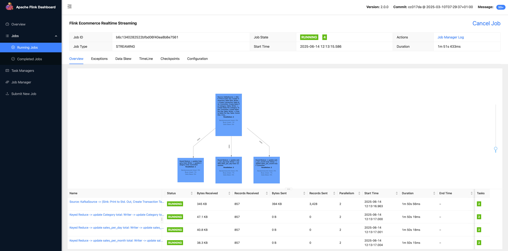

# Real-time Streaming with Apache Flink | End to End Data Engineering Project

## Introduction
The project is an end-to-end use case of eCommerce transactions, created in https://github.com/airscholar/FlinkCommerce 
1. Use Apache Kafka to ingest transaction data. setup cluster of 3 Kafka brokers to improve the data reliability  
2. Process in real-time in Apache Flink, which is a distributed system with Job Manager and Task Manager that enables reliable and scalable process of data stream. 
The data stream process includes the follow tasks: 
* transactions are aggregated before persisting in Postgres
* transactions are indexed in elasticSearch, and available for data visualization in Kabana

The project has updated the versions of Kafka to use Kraft instead of zookeeper; Flink 2.0 a major update in DataStreamAPI 


### Setup 
 - Start docker containers in ```docker-compose.yml```
 - Start Flink DataStream Job on Docker Container
   ```
    docker exec flink-jobmanager /opt/flink/bin/flink run -c FlinkCommerce.DataStreamJob /opt/flink/datastream/FlinkEcommerce-2.0-SNAPSHOT.jar --POSTGRES_HOSTNAME postgres --KAFKA_BOOTSTRAP_SERVER kafka-2 --KAFKA_BOOTSTRAP_PORT 29092 --ELASTIC_SERVER es-container
   ```
- Produce data to Kafka using ```TransactionGen``` in Python
  ```
  cd $PROJECT_HOME
  python3 producer.py
  ```
  
Or you can [install Apache Flink locally](https://www.apache.org/dyn/closer.lua/flink/flink-2.0.0/flink-2.0.0-bin-scala_2.12.tgz)
 - Customize Flink configuration `````$FLINK_HOME/conf/config.yaml`````
   - Increase number of Tasks: 
     ```
     taskmanager:
        numberOfTaskSlots: 4
     ```
   - Increase parallelism:
     ```
     parallelism:
     # The parallelism used for programs that did not specify and other parallelism.
        default: 2
     ```
 - Start Flink Server
    ```
    $FLINK_HOME/bin ./start_cluster.sh
    ```
 - Start Flink DataStream Job
    ```
    cd $PROJECT_HOME
    $FLINK_HOME run -c FlinkCommerce.DataStreamJob target/FlinkEcommerce-2.0-SNAPSHOT.jar
    ```

### Results 
- Transaction data is written to postgres tables: ```transactions, sales_per_category, sales_per_day, sales_per_month```
- Log on to ElasticSearch (http://localhost:5601) 
In Elastic Dev Tools, you can run Elasticsearch API such as
    ```GET transactions/_search```
- Build the charts in Kabana with the transactions data indexed
   


### Learning 
- Flink [DataStreamAPI](https://nightlies.apache.org/flink/flink-docs-release-2.0/docs/dev/datastream/overview/) and its architecture
  

### To Do
- Add unit tests 
- ~~Containerize Apache Flink services~~ (Done) 