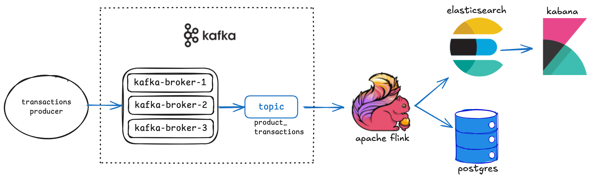
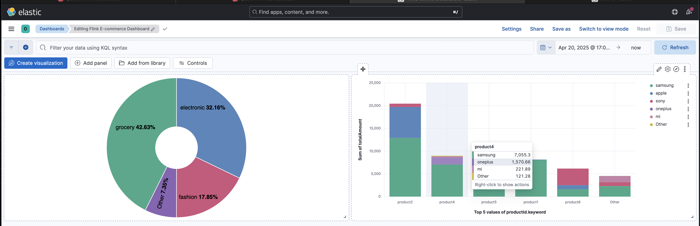

# Real-time Streaming with Apache Flink | End to End Data Engineering Project

## Introduction
The project is an end-to-end use case of eCommerce transactions. 
1. Use Apache Kafka to ingest transaction data. setup cluster of 3 kafka brokers to improve the data reliability  
2. Process in real-time in Apache Flink, which is a distributed system with Job Manager and Task Manager that enables reliable and scalable process of data stream. 
The data stream process includes the follow tasks: 
* transactions are aggregated before persisting in Postgres
* transactions are indexed in elasticSearch, and available for data visualization in Kabana


### Setup 
 - Start docker containers in ```docker-compose.yml```
 - Install Apache Flink (on Local)
 - Customize Flink configuration `````$FLINK_HOME/conf/config.yaml`````
   - Increase number of Tasks: 
     ```
     taskmanager:
        numberOfTaskSlots: 4
     ```
   - Increase parallelism:
     ```
     parallelism:
     # The parallelism used for programs that did not specify and other parallelism.
        default: 2
     ```

 - Start Flink Server
    ```bash
    $FLINK_HOME/bin ./start_cluster.sh
    ```
 - Produce data in TransactionGen in Python
    ```bash
    cd $PROJECT_HOME
    python3 producer.py
    ```
 - Start Flink DataStream Job
    ```
    cd $PROJECT_HOME
    $FLINK_HOME run -c FlinkCommerce.DataStreamJob target/FlinkEcommerce-2.0-SNAPSHOT.jar
    ```

### Results 
- Transaction data is written to postgres tables: ```transactions, sales_per_category, sales_per_day, sales_per_month```
- Log on to ElasticSearch http://localhost:5601 
In Elastic Dev Tools, you can run Elasticsearch API such as
    ```GET transactions/_search```
- Build the charts in Kabana with the transactions data indexed
   


### Learning 
- Flink DataStreamAPI and its architecture


### To Do
- Add unit tests 